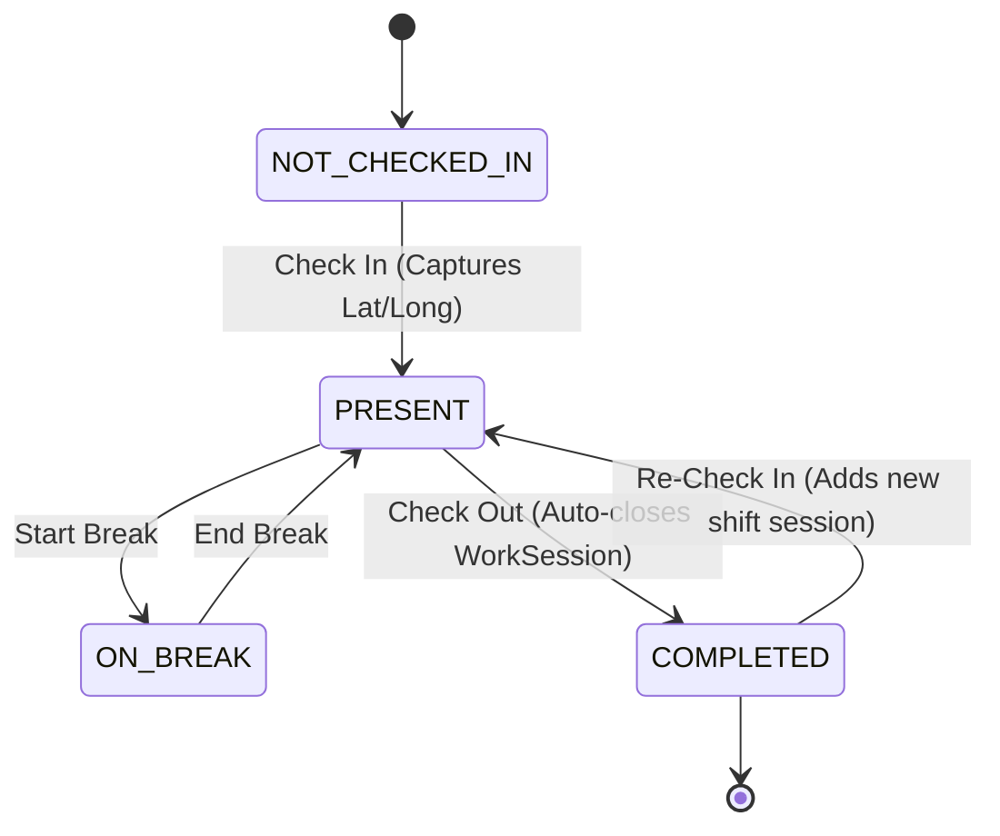

# System Architecture & Design Specification

## 1. Architectural Philosophy

`blindarea Production` is built on three core design principles:
1. **Lightweight Monolith over Microservices**: A cohesive Next.js full-stack application that deploys seamlessly to serverless environments (e.g. Vercel) with near-zero cold starts and low hosting overhead.
2. **Decoupled Attendance and Project Time Tracking**:
   - `Attendance` records physical office presence (Shift check-in, check-out, GPS location, break cycles).
   - `WorkSession` records cognitive task engagement (which video project or task an editor/creator is actively working on). Switching projects closes the active work session and begins a new one without affecting overall office attendance.
3. **Multi-Channel Content Lifecycle**: Content is modeled hierarchically:
   $$\text{Channel} \longrightarrow \text{Series (Optional)} \longrightarrow \text{Project} \longrightarrow \begin{cases} \text{Deliverables} \ (\text{Longform, Shorts, Reels}) \\ \text{Tasks} \ (\text{Editing, Thumbnail, Script, Shoot}) \end{cases}$$

---

## 2. Core Entities & State Machines

### 2.1 Attendance State Machine


### 2.2 Work Session Lifecycle
- Employee can start a `WorkSession` on any active `Project` once checked in.
- Employee can switch projects seamlessly at `/api/work-sessions/switch` (closes prior session, logs elapsed minutes, and creates new active session).
- Checking out of the office automatically completes any open `WorkSession`.

### 2.3 Master Content Project Lifecycle
`IDEA` $\rightarrow$ `RESEARCH` $\rightarrow$ `SCRIPTING` $\rightarrow$ `PRE_PRODUCTION` $\rightarrow$ `SHOOTING` $\rightarrow$ `POST_PRODUCTION` $\rightarrow$ `REVIEW` $\rightarrow$ `READY_FOR_RELEASE` $\rightarrow$ `PUBLISHED` $\rightarrow$ `ARCHIVED`

---

## 3. Role-Based Access Control (RBAC)

The system supports four distinct operational tiers:

```
                  ┌─────────────────┐
                  │   SUPER_ADMIN   │ Full studio control & config
                  └────────┬────────┘
                           │
                  ┌────────▼────────┐
                  │      ADMIN      │ Operations & crew management
                  └────────┬────────┘
                           │
                  ┌────────▼────────┐
                  │     MANAGER     │ Producers & Creative Directors
                  └────────┬────────┘
                           │
                  ┌────────▼────────┐
                  │    EMPLOYEE     │ Editors, DOPs, Writers, Designers
                  └─────────────────┘
```

### Permission Matrix

| Capability | SUPER_ADMIN | ADMIN | MANAGER | EMPLOYEE |
| :--- | :---: | :---: | :---: | :---: |
| Self Check-In/Out & Work Sessions | ✅ | ✅ | ✅ | ✅ |
| View & Update Assigned Tasks | ✅ | ✅ | ✅ | ✅ |
| Apply for Leaves | ✅ | ✅ | ✅ | ✅ |
| View Admin Production Dashboard | ✅ | ✅ | ✅ | ❌ |
| Create / Edit Channels & Series | ✅ | ✅ | ✅ | ❌ |
| Create Projects & Deliverables | ✅ | ✅ | ✅ | ❌ |
| Assign Tasks & Dispatch Daily Queue | ✅ | ✅ | ✅ | ❌ |
| Set Monthly Targets | ✅ | ✅ | ✅ | ❌ |
| Approve / Reject Leaves | ✅ | ✅ | ✅ | ❌ |
| Manage Crew Roster & Password Resets | ✅ | ✅ | ❌ | ❌ |
| View Audit Logs | ✅ | ✅ | ❌ | ❌ |
| Delete Channels or Projects | ✅ | ❌ | ❌ | ❌ |

---

## 4. Security Architecture

1. **Password Hashing**: Industry-standard **Argon2id** algorithm via `@node-rs/argon2`.
2. **Session Security**: Stateless, digitally-signed JWTs (`HS256`) stored in **HTTP-only, SameSite=Lax, Secure cookies**.
3. **Rate Limiting**: Sliding-window IP rate limiter on authentication endpoints (`/api/auth/login`) to prevent brute-force attacks.
4. **Audit Logging**: All administrative changes, employee modifications, leave approvals, and password resets are permanently recorded with actor identity, timestamp, and IP address.
