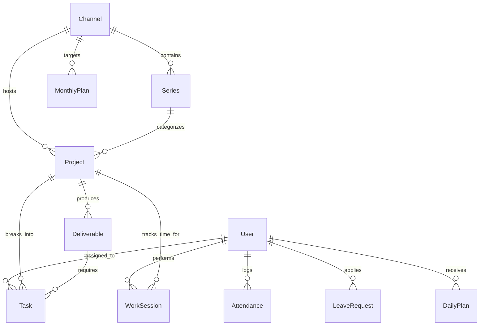

# Database Schema & Data Models

`blindarea Production` uses MongoDB Atlas with Mongoose ODM for resilient, scalable data modeling.

---

## 1. Schema Diagrams

---

## 2. Collection Schemas

### `users`
- `_id`: ObjectId
- `username`: String (Unique, Indexed)
- `password`: String (Argon2id hash)
- `name`: String
- `role`: Enum (`'SUPER_ADMIN'`, `'ADMIN'`, `'MANAGER'`, `'EMPLOYEE'`)
- `designation`: String (e.g. "Lead Video Editor", "Cinematographer")
- `phone`: String
- `isActive`: Boolean (Default: `true`)
- `mustChangePassword`: Boolean
- `createdAt`, `updatedAt`: Date

### `channels`
- `_id`: ObjectId
- `name`: String
- `code`: String (Unique, Indexed, e.g. "BTECH")
- `platform`: Enum (`'YOUTUBE'`, `'INSTAGRAM'`, `'FACEBOOK'`, `'TIKTOK'`, `'TWITTER_X'`, `'OTHER'`)
- `channelUrl`: String
- `isActive`: Boolean
- `createdAt`, `updatedAt`: Date

### `series`
- `_id`: ObjectId
- `channelId`: ObjectId $\to$ `channels` (Indexed)
- `name`: String (e.g. "Flagship Reviews")
- `code`: String (e.g. "REV")
- `description`: String
- `isActive`: Boolean
- `createdAt`, `updatedAt`: Date

### `projects`
- `_id`: ObjectId
- `title`: String
- `code`: String (Unique, Indexed, e.g. "S26-REV")
- `description`: String
- `channelId`: ObjectId $\to$ `channels` (Indexed)
- `seriesId`: ObjectId $\to$ `series` (Optional, Indexed)
- `status`: Enum (`'IDEA'`, `'RESEARCH'`, `'SCRIPTING'`, `'PRE_PRODUCTION'`, `'SHOOTING'`, `'POST_PRODUCTION'`, `'REVIEW'`, `'READY_FOR_RELEASE'`, `'PUBLISHED'`, `'ARCHIVED'`)
- `priority`: Enum (`'LOW'`, `'MEDIUM'`, `'HIGH'`, `'URGENT'`)
- `leadAssigneeId`: ObjectId $\to$ `users` (Indexed)
- `targetReleaseDate`: Date
- `tags`: Array of Strings
- `isActive`: Boolean

### `deliverables`
- `_id`: ObjectId
- `projectId`: ObjectId $\to$ `projects` (Indexed)
- `title`: String (e.g. "YouTube 4K Main Feature")
- `type`: Enum (`'YOUTUBE_MAIN_VIDEO'`, `'YOUTUBE_SHORTS'`, `'INSTAGRAM_REEL'`, `'INSTAGRAM_POST'`, `'INSTAGRAM_STORY'`, `'FACEBOOK_VIDEO'`, `'FACEBOOK_REEL'`, `'COMMUNITY_POST'`, `'THUMBNAIL_PRIMARY'`, `'OTHER'`)
- `platform`: Enum (`'YOUTUBE'`, `'INSTAGRAM'`, `'FACEBOOK'`, `'TIKTOK'`, `'TWITTER_X'`, `'OTHER'`)
- `aspectRatio`: Enum (`'16:9'`, `'9:16'`, `'1:1'`, `'4:5'`)
- `targetDurationSeconds`: Number
- `status`: Enum (`'DRAFT'`, `'SCRIPTED'`, `'RECORDED'`, `'EDITING'`, `'IN_REVIEW'`, `'CHANGES_REQUESTED'`, `'APPROVED'`, `'SCHEDULED'`, `'PUBLISHED'`)
- `scheduledReleaseDate`: Date

### `tasks`
- `_id`: ObjectId
- `projectId`: ObjectId $\to$ `projects` (Optional, Indexed)
- `deliverableId`: ObjectId $\to$ `deliverables` (Optional, Indexed)
- `title`: String
- `type`: Enum (24 production task stages: `'IDEA_RESEARCH'`, `'SCRIPT_WRITING'`, `'STUDIO_SHOOT'`, `'VIDEO_EDITING'`, `'COLOR_GRADING'`, `'SOUND_DESIGN'`, `'THUMBNAIL_DESIGN'`, `'MOTION_GRAPHICS'`, `'SEO_METADATA'`, `'PUBLISHING_DISTRIBUTION'`, etc.)
- `description`: String
- `status`: Enum (`'TODO'`, `'IN_PROGRESS'`, `'IN_REVIEW'`, `'CHANGES_REQUESTED'`, `'APPROVED'`, `'COMPLETED'`, `'BLOCKED'`)
- `priority`: Enum (`'LOW'`, `'MEDIUM'`, `'HIGH'`, `'URGENT'`)
- `assigneeId`: ObjectId $\to$ `users` (Indexed)
- `estimatedMinutes`: Number
- `dueDate`: Date

### `worksessions`
- `_id`: ObjectId
- `userId`: ObjectId $\to$ `users` (Indexed)
- `attendanceId`: ObjectId $\to$ `attendances` (Indexed)
- `projectId`: ObjectId $\to$ `projects` (Indexed)
- `taskId`: ObjectId $\to$ `tasks` (Optional)
- `startTime`: Date (Indexed)
- `endTime`: Date
- `durationMinutes`: Number
- `status`: Enum (`'ACTIVE'`, `'PAUSED'`, `'COMPLETED'`, `'SWITCHED'`)
- `notes`: String

### `attendances`
- `_id`: ObjectId
- `userId`: ObjectId $\to$ `users` (Indexed)
- `date`: String (Format: `YYYY-MM-DD`, Indexed compound with `userId`)
- `status`: Enum (`'NOT_CHECKED_IN'`, `'PRESENT'`, `'ON_BREAK'`, `'COMPLETED'`, `'ABSENT'`, `'MISSED_CHECKOUT'`)
- `checkInTime`: Date
- `checkOutTime`: Date
- `checkInLocation`: `{ latitude: Number, longitude: Number, accuracy: Number }`
- `checkOutLocation`: `{ latitude: Number, longitude: Number, accuracy: Number }`
- `sessions`: Array of `{ checkIn: Date, checkOut: Date, durationMinutes: Number }`
- `breaks`: Array of `{ start: Date, end: Date, durationMinutes: Number }`
- `totalWorkingMinutes`: Number
- `totalBreakMinutes`: Number

### `monthlyplans`
- `_id`: ObjectId
- `channelId`: ObjectId $\to$ `channels` (Indexed)
- `year`: Number
- `month`: Number (1 - 12)
- `targetLongformVideos`: Number
- `targetShortsReels`: Number
- `primaryFocus`: String

### `dailyplans`
- `_id`: ObjectId
- `userId`: ObjectId $\to$ `users` (Indexed)
- `date`: String (Format: `YYYY-MM-DD`, Indexed)
- `assignedTaskIds`: Array of ObjectIds $\to$ `tasks`
- `focusGoal`: String
